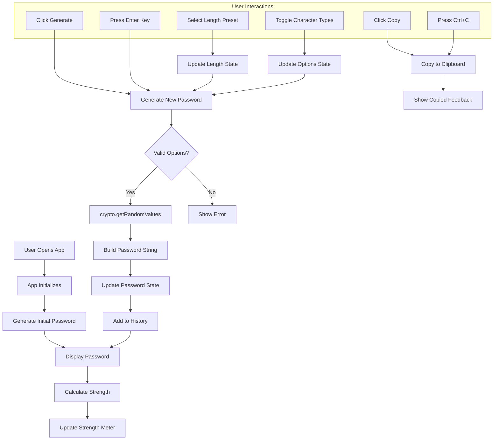
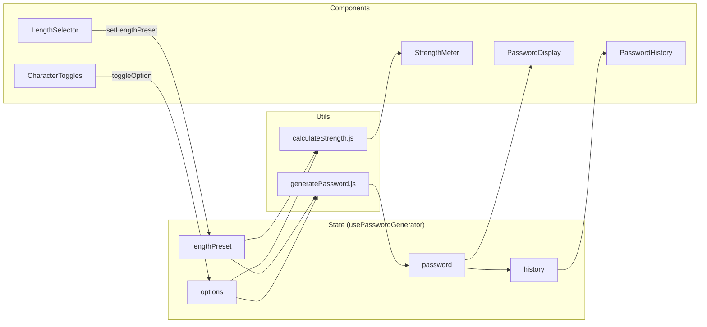
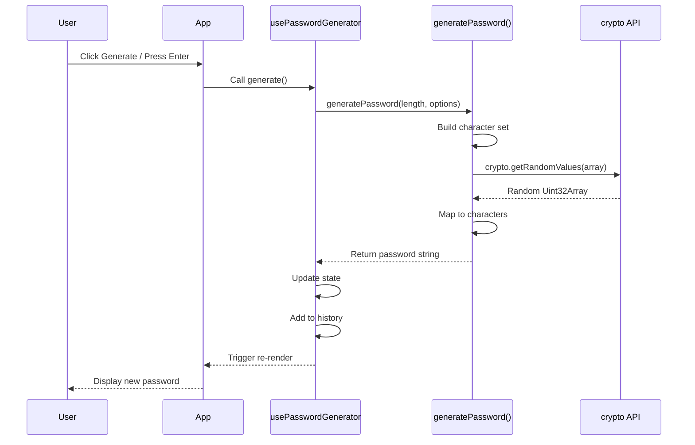
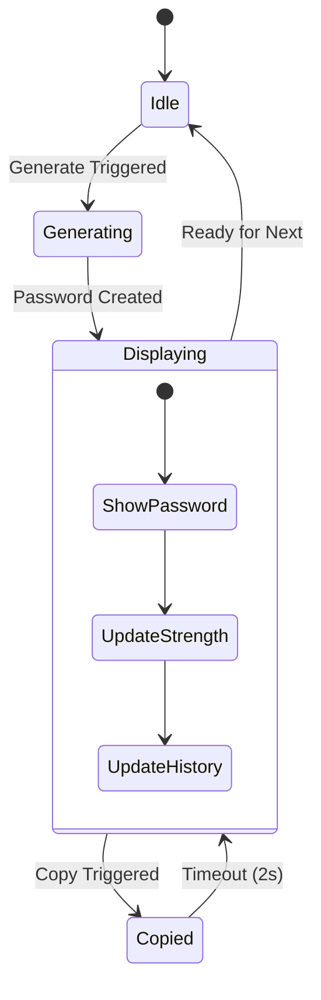

# SecurePass Generator - Planning Document

## Project Overview

A React-based web application for generating secure, customizable passwords with a modern dark theme UI.

---

## Application Architecture

### Technology Stack
- **Framework:** React 18+
- **Build Tool:** Vite
- **Styling:** CSS (Dark theme with neon accents)
- **State Management:** React Hooks

### Directory Structure

```
password-generator/
├── public/
├── src/
│   ├── components/       # UI Components
│   ├── hooks/            # Custom React Hooks
│   ├── utils/            # Core Business Logic
│   ├── styles/           # Global Styles
│   ├── App.jsx           # Main Application
│   └── main.jsx          # Entry Point
├── docs/                 # Documentation
├── package.json
└── CLAUDE.md
```

---

## Component Hierarchy

```
App
├── Header
├── PasswordDisplay
│   └── CopyButton
├── StrengthMeter
├── LengthSelector
├── CharacterToggles
├── PasswordHistory
│   └── HistoryItem(s)
└── KeyboardShortcuts
```

---

## Application Flow Diagram



---

## Data Flow Diagram



---

## Password Generation Flow



---

## State Management



---

## Key Features

### 1. Password Generation
- Cryptographically secure using `crypto.getRandomValues()`
- Configurable character types (uppercase, lowercase, numbers, special)
- Preset lengths: 8, 12, 16, 32 characters

### 2. Strength Indicator
| Length | Character Types | Strength |
|--------|----------------|----------|
| < 8    | Any            | Weak     |
| 8-11   | 2+             | Fair     |
| 12-15  | 3+             | Good     |
| 16+    | All 4          | Strong   |

### 3. Password History
- Session-based (cleared on tab close)
- Last 10 passwords stored
- Masked by default, reveal on hover
- Individual copy buttons

### 4. Keyboard Shortcuts
| Key | Action |
|-----|--------|
| Enter | Generate password |
| Ctrl+C | Copy password |
| Escape | Clear history |

---

## Security Considerations

1. **No Server Communication** - All generation client-side
2. **Secure Randomness** - Uses Web Crypto API
3. **No Persistent Storage** - History in memory only
4. **No External Dependencies** - Core logic dependency-free

---

## Future Enhancements (V2+)

- [ ] Pronounceable passwords
- [ ] Passphrase generator
- [ ] Custom special character set
- [ ] Export to file
- [ ] PWA support
- [ ] Browser extension

---

## Development Commands

```bash
# Start development server
npm run dev

# Build for production
npm run build

# Preview production build
npm run preview
```
